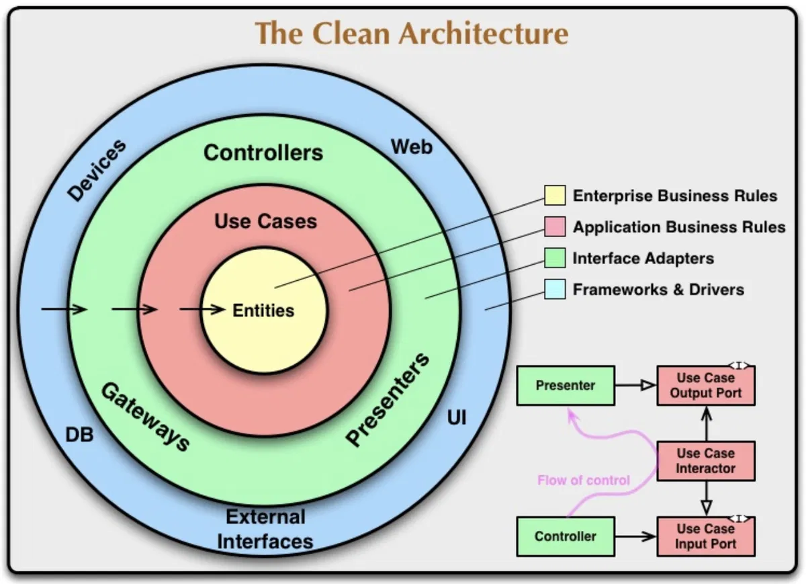

**Khái niệm Clean Architecture**: một kiến trúc dựa trên nguyên lý Dependency Inversion, bao gồm 4 layer được chia thành 4 vòng tròn như ảnh. Các lớp bên ngoài (Database, UI, Framework) có thể biết và gọi các lớp bên trong (Entities, UseCases), nhưng chiều ngược lại thì tuyệt đối cấm.

## Các lớp

**Lớp 1**: Domain Layer
Nhiệm vụ: Chứa các Business Logic, nơi giúp giải quyết các vấn đề của enterprise, không import các thư viện của framework

Bao gồm: Entities, Interfaces

Quy tắc (Strict): Hoàn toàn là TypeScript thuần. Không import bất kỳ thứ gì từ NestJS, TypeORM, hay thư viện bên thứ 3 (ngoại trừ các utility thư viện dùng để hỗ trợ logic thuần).

**Lớp 2**: Application Layer
Nhiệm vụ: Nhận yêu cầu từ người dùng, gọi database qua interface để lấy dữ liệu, gọi Domain để chạy logic, rồi lưu lại, đóng vai trò điều phối

Bao gồm: Use Cases (các services), Application DTOs/Commands.

Quy tắc: Chỉ phụ thuộc vào tầng Domain. Gọi database và các dịch vụ bên ngoài thông qua Interfaces (Ports), tuyệt đối không gọi trực tiếp class Implements.

**Lớp 3**: Infrastructure Layer
Nhiệm vụ: Là nơi giao tiếp với thế giới bên ngoài: Database, Message Brokers (Kafka, RabbitMQ), External APIs (Stripe, SendGrid), thư viện bảo mật (Bcrypt, JWT).

Bao gồm: Data Models (TypeORM @Entity), Repository (phần implementation), external services, ...
Quy tắc: Các file ở đây phải implements các interfaces đã được định nghĩa ở tầng domain hoặc application.

**Lớp 4**: Presentation Layer
Nhiệm vụ: Nhận Request từ Client (HTTP REST, GraphQL, gRPC), kiểm tra định dạng dữ liệu đầu vào và trả về Response.

Bao gồm: Controllers, request DTOs, ...

Quy tắc: Chỉ được phép gọi tầng Application (Use Cases). Không được chứa logic nghiệp vụ, không được gọi trực tiếp TypeORM Entity hay Repository.

## Lí do sử dụng

**Độc lập với Framework & Database**: Ngày mai kiến trúc đổi từ TypeORM sang Prisma, đổi PostgreSQL sang MongoDB? Chỉ cần viết lại Infras, còn domain hay application giữ nguyên

**Dễ dàng Test**: Tầng Domain là TypeScript thuần, không dính dáng đến DB hay Request/Response. Ta có thể viết Unit Test cho nó chạy vèo vèo mà không cần bật server hay kết nối Database.

Tính Scalibility: Code được chia trách nhiệm rõ ràng giúp fix, update phần nào rất dễ dàng.
